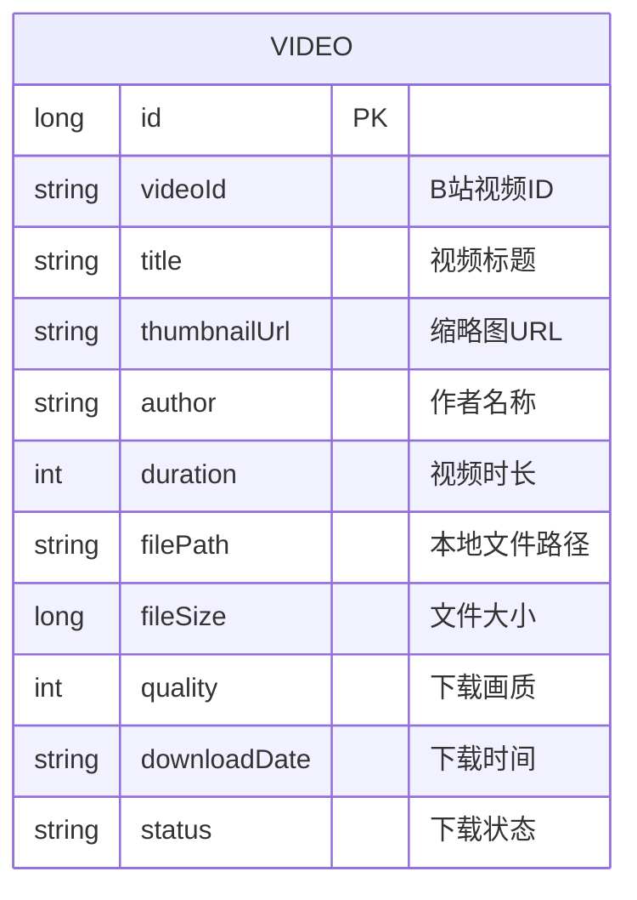

## 1. Architecture Design

```mermaid
graph TB
    subgraph "移动端应用层
        UI[用户界面]
        DownloadManager[下载管理器]
        HistoryManager[历史记录管理器]
    end
    
    subgraph "核心逻辑层"
        VideoParser[视频解析器]
        VideoDownloader[视频下载器]
        FileManager[文件管理器]
    end
    
    subgraph "数据存储层
        LocalStorage[本地存储]
        MediaStore[媒体存储]
    end
    
    UI --&gt; VideoParser
    UI --&gt; DownloadManager
    DownloadManager --&gt; VideoDownloader
    DownloadManager --&gt; FileManager
    HistoryManager --&gt; LocalStorage
    FileManager --&gt; MediaStore
```

## 2. Technology Description
- 移动端框架：React Native (Expo) 或 原生安卓开发
- 原生安卓 (Jetpack Compose
- 网络请求：OkHttp / Retrofit
- 视频解析：自定义解析B站API获取视频流地址
- 视频下载：DownloadManager 或 自定义下载器
- 本地存储：Room Database / SharedPreferences
- 媒体存储：MediaStore API

## 3. Route Definitions
| 页面 | 用途 |
|------|------|
| MainActivity | 主页面，链接输入和下载控制 |
| HistoryActivity | 下载历史页面 |

## 4. API Definitions (if backend exists)
- 不适用，纯移动端应用，无后端服务

## 5. Server Architecture Diagram (if backend exists)
- 不适用

## 6. Data Model (if applicable)

### 6.1 Data Model Definition



### 6.2 Data Definition Language

```kotlin
// Room Database Schema
@Entity(tableName = "videos")
data class Video(
    @PrimaryKey(autoGenerate = true
    val id: Long = 0,
    val videoId: String,
    val title: String,
    val thumbnailUrl: String,
    val author: String,
    val duration: Int,
    val filePath: String?,
    val fileSize: Long,
    val quality: String,
    val downloadDate: Long,
    val status: String
)
```

## 7. 技术实现方案选择
由于用户需要的是安卓原生安卓应用，我将创建一个基于 **React Native + Expo** 的项目，这样可以快速开发并支持原生功能。同时，为了解析和下载B站视频，我们需要：

1. 使用B站开放API解析视频信息
2. 直接获取已合并的音画视频流地址
3. 使用原生下载管理器下载
4. 保存到设备存储
