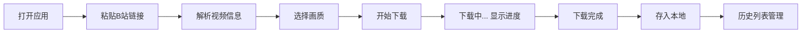

## 1. Product Overview
B站视频下载应用，用户只需粘贴视频链接即可直接下载包含音画的完整视频文件，无需音频视频分离再合并的复杂步骤。
- 主要面向需要下载B站视频的安卓用户，解决传统下载工具需要多步骤合并的痛点
- 提供极简、高效的下载体验

## 2. Core Features

### 2.1 User Roles (if applicable)
| Role | Registration Method | Core Permissions |
|------|---------------------|------------------|
| Normal User | 无需注册 | 粘贴链接、下载视频、查看下载历史 |

### 2.2 Feature Module
1. **主页面**: 链接输入框、下载按钮、下载状态显示
2. **下载历史**: 已下载视频列表、管理功能

### 2.3 Page Details
| Page Name | Module Name | Feature description |
|-----------|-------------|---------------------|
| 主页面 | 链接输入 | 支持粘贴B站视频链接，自动识别视频信息 |
| 主页面 | 下载控制 | 选择下载画质，开始/暂停/取消下载，显示下载进度 |
| 主页面 | 下载状态 | 实时显示下载百分比、速度、剩余时间 |
| 下载历史 | 历史列表 | 显示已下载视频的缩略图、标题、文件大小、下载时间 |
| 下载历史 | 文件管理 | 支持播放、删除、分享已下载的视频 |

## 3. Core Process
用户打开应用 → 粘贴B站视频链接 → 应用解析视频信息 → 选择下载画质 → 开始下载 → 下载完成后存入本地 → 在历史列表中管理

## 4. User Interface Design
### 4.1 Design Style
- 主色调：B站标志性的粉色 (#FB7299) 搭配深色背景 (#18191C)
- 按钮风格：圆角矩形，带有微妙的阴影效果
- 字体：思源黑体，清晰易读
- 布局风格：卡片式布局，简洁现代
- 图标风格：Material Design 图标，简洁直观

### 4.2 Page Design Overview
| Page Name | Module Name | UI Elements |
|-----------|-------------|-------------|
| 主页面 | 顶部栏 | 应用Logo，标题 |
| 主页面 | 链接输入区 | 大尺寸输入框，粘贴按钮 |
| 主页面 | 视频信息区 | 视频缩略图、标题、作者信息卡片 |
| 主页面 | 下载控制区 | 画质选择下拉框、下载按钮、进度条 |
| 主页面 | 状态提示 | 下载状态文字提示、错误提示 |
| 下载历史 | 列表 | 网格布局的视频卡片 |
| 下载历史 | 卡片 | 缩略图、标题、文件信息、操作按钮 |

### 4.3 Responsiveness
- 移动端优先设计，适配不同屏幕尺寸
- 触摸友好的按钮大小（≥48dp）
- 优化竖屏使用体验

### 4.4 3D Scene Guidance (if applicable)
- 不适用
